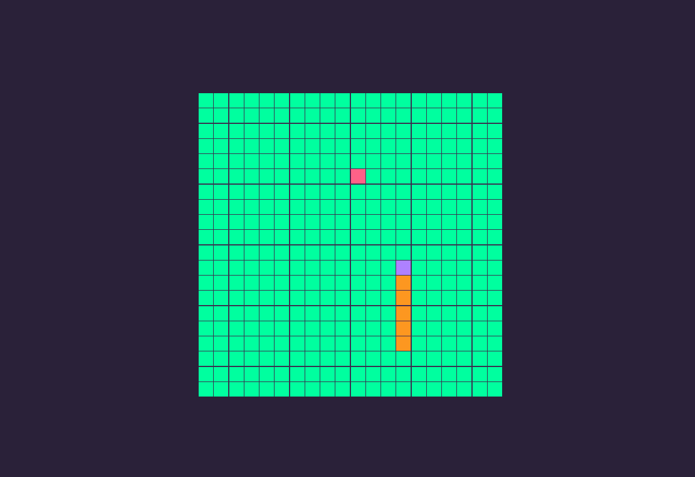

<h1 align="center">Snake Game (with Functional JS)</h1>

Recreating the Snake game with Functional JS

  
  
<i>Snake Game</i>

 

  <h2>Thanks 4 everyone!</h2>
  
Made w/ 💙 by <a href="https://github.com/pratesMath">pratesMath</a>.

